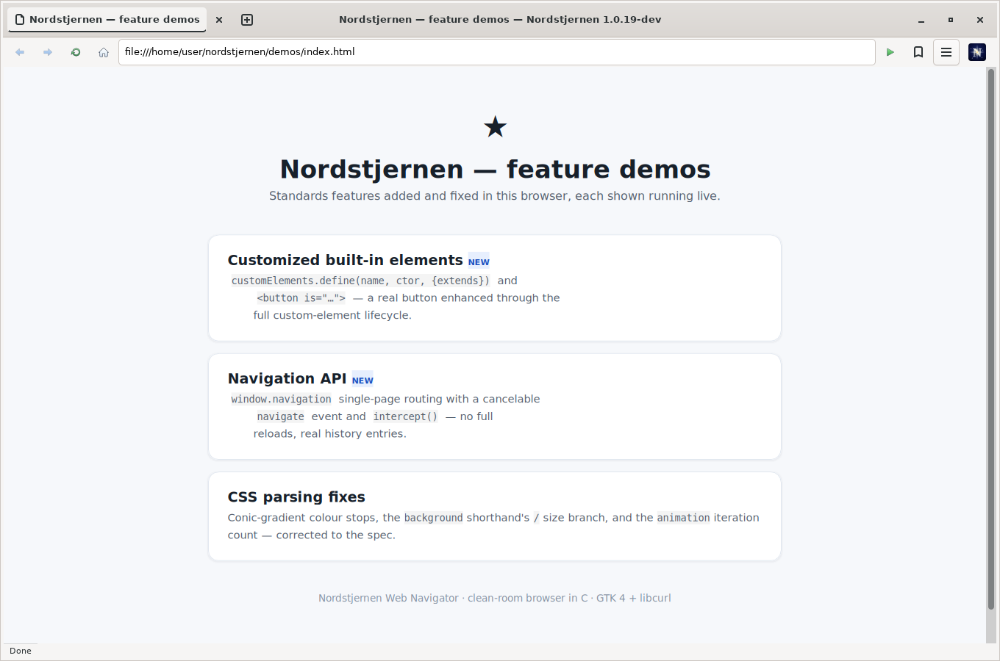
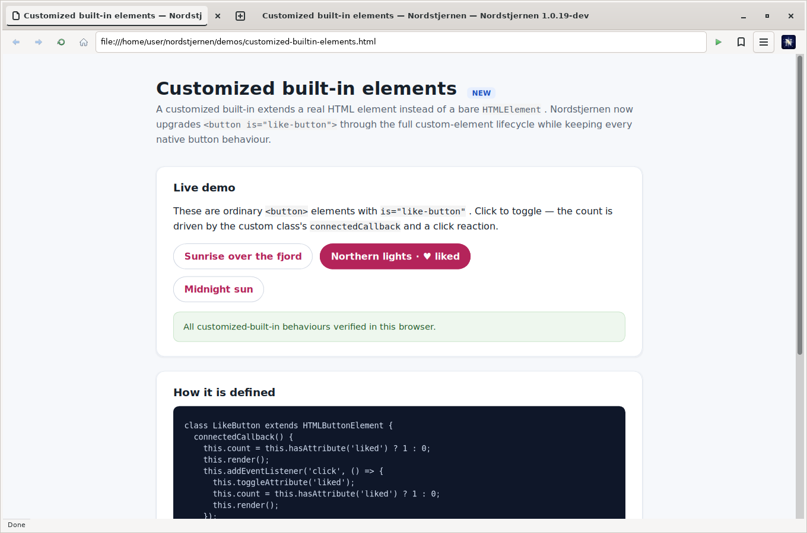
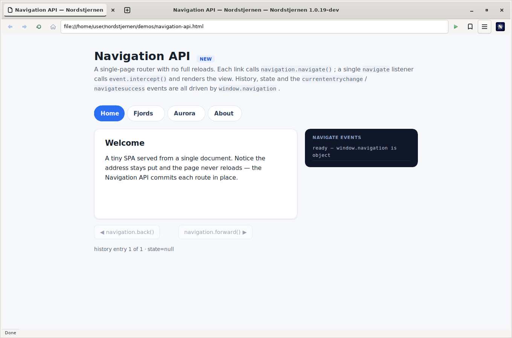
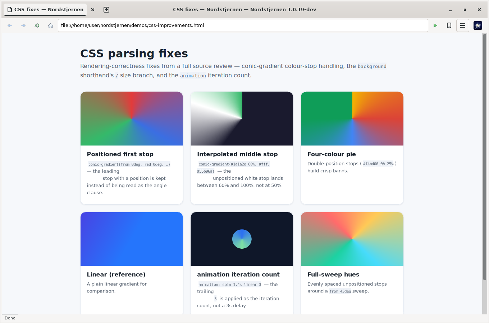

# Feature demos

Live, self-contained pages demonstrating capabilities added and fixed in
Nordstjernen. Open `demos/index.html` in the browser, or load any page
directly.

| Demo | Shows |
|------|-------|
| [`customized-builtin-elements.html`](customized-builtin-elements.html) | Customized built-in elements — `customElements.define(name, ctor, {extends})` and `<button is="…">` upgraded through the full custom-element lifecycle. |
| [`navigation-api.html`](navigation-api.html) | The Navigation API — `window.navigation` single-page routing with a cancelable `navigate` event and `intercept()`. |
| [`css-improvements.html`](css-improvements.html) | CSS parsing fixes — conic-gradient colour stops, the `background` shorthand's `/` size branch, and the `animation` iteration count. |

## Screenshots

Captured from the running GTK browser (`demos/screenshots/`).

